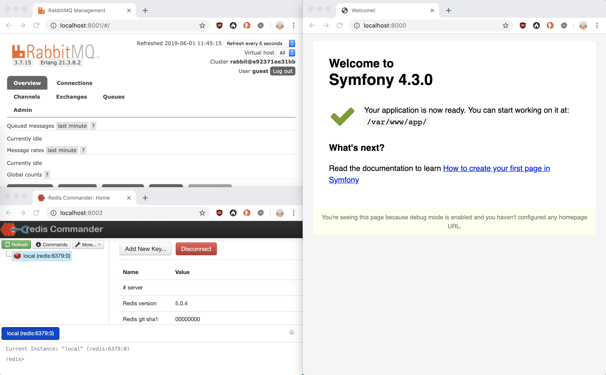

Workshop skeleton
=================

This is a basic Symfony application with a basic docker setup for development.

This dockerized skeleton will provide all the services we need throughout
the workshop, plus some more to play around with. This is not intended as a
template for a production ready environment and most likely is even missing
things you might want in your regular development setup like SSL certificates.

Installation
------------

1. Clone project

    ```bash
    git clone https://github.com/dbrumann/workshop-skeleton.git
    ```

1. Build docker image for app

    ```bash
    # cd workshop-skeleton
    docker-compose build
    ```

1. Start up docker containers

    ```bash
    docker-compose up -d
    ```

    The `-d`-flag is optional and allows you to run other commands afterwards

1. Install project dependencies for the Symfony application

    ```bash
    docker-compose exec app composer install
    ```

Checking if everything is working
---------------------------------

Once you followed the installation instructions, you should be able to open the
following URLs in your preferred browser:

 * http://localhost:8000 (Symfony application)
 * http://localhost:8001 (RabbitMQ Management UI)
 * http://localhost:8002 (Redis Commander Web Interface)



Additionally you should be able to connect to the MySQL database on port 3306.

If you can access each section, you are well prepared for the workshop
and ready to get started :+1:

Troubleshooting
---------------

**I can not connect to one or more of the services (RabbitMQ, Redis, MySQL)**

This could be, because the port is already being used, e.g. by a local
instance. You can modify the `docker-compose.yml` to change the port being
exposed to the outside by checking the service's `port:` settings and changing
the value before the colon. Another option could be to temporarily disable
the local service if you have permissions.

**The Symfony application only shows a blank page**

This could be because of file permissions or problems with mounting the
volume. Please make sure the directory has permissions for File Sharing
in your Docker preferences.


**I am not permitted to install Docker on my machine**

If you can not use the dockerized setup, don't worry. We will not need most
of the services provided, only the Symfony application and a database.
Feel free to run things locally using the following instructions:

 1. Clone repository
 1. Install dependencies using `composer install`
 1. Run a PHP internal webserver: `php -S 127.0.0.1:8000 -t public/`

Additionally make sure that you have a database server like MySQL or Postgres
running or whether you have sqlite3 installed. To make sure the database is
usable by your PHP applications, you can check `php -m | grep pdo`. This should
print out the name of all available drivers you can use.

**I have XAMPP, WAMPP or something similar setup, can I use that?**

Yes, but I have not used those in a while, so I might not have the time to
properly assist you, should you run into problems. Please make sure in advance
that you have PHP 7.1+ and a database you can use.

**How can I run Symfony console commands?**

You can log into the app-service to run console commands, just like you are
used to:

```bash
docker-compose exec app bash
```

This will open a terminal inside the container in the project folder, so
afterwards you can run commands like `bin/console cache:clear`. If you only
want to run a single command you can also replace `bash` with that command:

```bash
docker-compose exec app bin/console cache:clear
```

Some development tools like PhpStorm also allow you to connect to containers
and perform commands.

Issues, questions and suggestions
---------------------------------

Should you have any other issue not covered in the troubleshooting guide or
need further assistance with setting up the skeleton don't hesitate to contact
me, preferably via email:

    denis.brumann@sensiolabs.de
